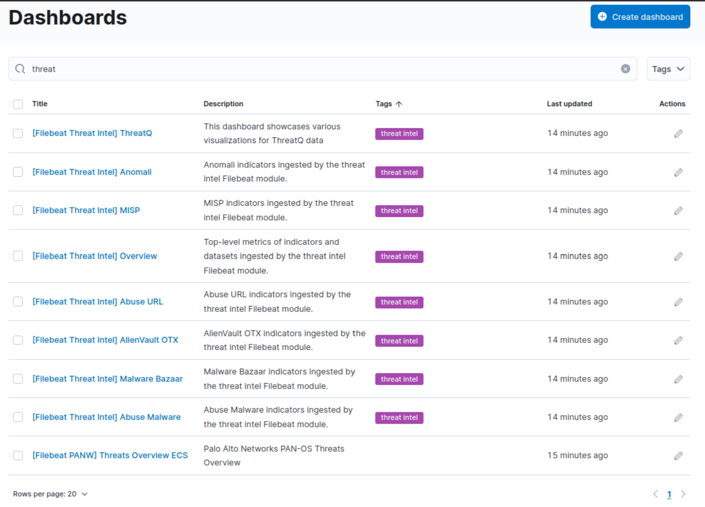
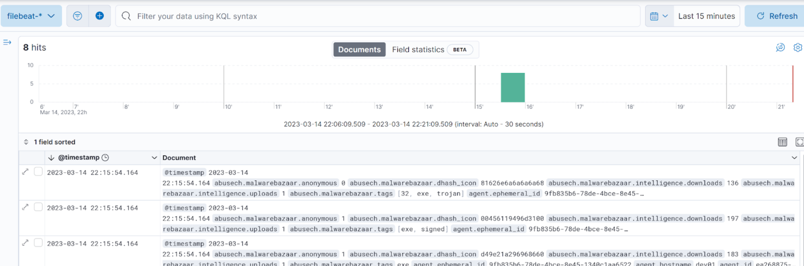
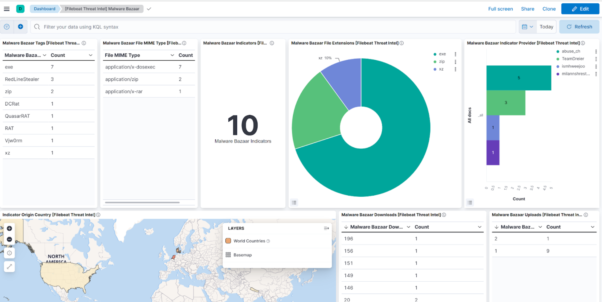
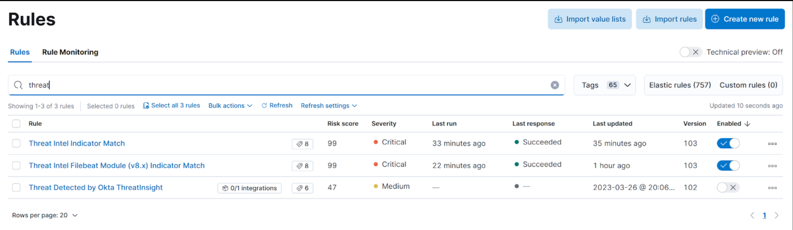
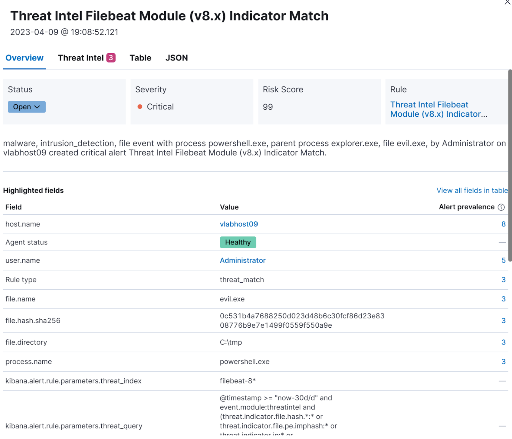
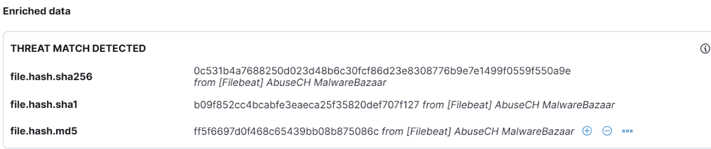

To work with threat intelligence feeds, we need to make some modifications to our Elastic stack. Once set up, a Filebeat process will download indicators from threat intelligence sources, and send them to an index in our Elastic stack.

The first step we need to complete is the installation of Filebeat. Filebeat is available for multiple platforms. You can find the installation instructions for your platform from the Filebeat download page here:

https://www.elastic.co/downloads/beats/filebeat

The installation process creates a number of files in /etc/filebeat/ (“c:\Program Files\Elastic\Beats\” for Windows users). We will need to make modifications to two files in this directory, specifically filebeat.yml and modules.d/threatintel.yml. 

Next we need to configure Filebeat. First we need to modify filebeat.yml. The important sections to fill in are the Kibana sections, specifically setup.kibana.host, and the elastic section. 

|||
| :--- | :--- | 
setup.kibana.host | [Ip address of elastic stack:5601]
output.elasticsearch.hosts | [ip address of elastic stack:9200]
output.elasticsearch.protocol | https
username | [The username used to log into your elastic stack (unless using an API key)]
password | [The password used to log into your elastic stack (unless using an API key)]
output.elasticsearch.api_key | [You can use either this or a username/ password]
output.elasticsearch.ssl.enabled | true
output.elasticsearch.ssl.verification_mode | none

Instead of the username/ password, you can configure the output.elasticsearch.api_key value, provided you first created an API key from within Elastic.

Your filebeat configuration file can look similar to the following excerpt. Note that for our lab setting we change the ssl verification_mode to none. This setting is insecure, and not recommended for production deployments. Also note that in the example below, an API key was used and the username/ password fields were commented out.

#### filebeat.yml

~~~
# =================================== Kibana ===================================

# Starting with Beats version 6.0.0, the dashboards are loaded via the Kibana API.
# This requires a Kibana endpoint configuration.
setup.kibana:
  host: "10.30.23.160:5601"

# ---------------------------- Elasticsearch Output ----------------------------
output.elasticsearch:
  # Array of hosts to connect to.
  hosts: ["10.30.23.160:9200"]

  # Protocol - either `http` (default) or `https`.
  protocol: "https"

  # Authentication credentials - either API key or username/password.
  api_key: "n9oMGoYBveed5bgmjN6g:gJwjntZxSEqReIRACdB8hw"
  #username: "elastic"
  #password: "el1st3c::pwd5"
  ssl:
    enabled: true
    verification_mode: none

~~~

Next we need to enable the filebeat threat intelligence module. Navigate to the modules sub-directory and rename ‘threatintel.yml.disabled’ to ‘threatintel.yml’. Next, we’ll edit this file to enable some  sources. For starters, we can enable the abuseurl, abusemalware and malwarebazaar sources.

modules.d/threatintel.yml

<...truncated..>
~~~
abuseurl:
    enabled: true
~~~
<...truncated..>
~~~
abusemalware:
    enabled: true
~~~
<...truncated..>
~~~
malwarebazaar:
    enabled: true
~~~
<...truncated..>

Next we can run the setup command:

Filebeat setup

~~~sh
examiner@dev01:~$ sudo filebeat setup
Overwriting ILM policy is disabled. Set `setup.ilm.overwrite: true` for enabling.

Index setup finished.
Loading dashboards (Kibana must be running and reachable)
Loaded dashboards
Loaded Ingest pipelines
~~~

After running this command, you will notice a couple new dashboards created in your Elastic instance (Navigate to Analytics -> Dashboard, then search for “threat”).

Finally, we can run the filebeat service 

~~~sh
examiner@dev01:~$ sudo systemctl start filebeat
[sudo] password for examiner:
examiner@dev01:~$ systemctl status filebeat
● filebeat.service - Filebeat sends log files to Logstash or directly to Elasticsearch.
     Loaded: loaded (/lib/systemd/system/filebeat.service; disabled; vendor preset: enabled)
     Active: active (running) since Wed 2023-03-15 02:04:19 UTC; 484ms ago
       Docs: https://www.elastic.co/beats/filebeat
   Main PID: 293296 (filebeat)
      Tasks: 5 (limit: 9441)
     Memory: 33.8M
     CGroup: /system.slice/filebeat.service
             └─293296 /usr/share/filebeat/bin/filebeat --environment systemd -c /etc/filebeat/filebeat.yml --path.home /usr/share/filebeat --path.config /etc/file>

Mar 15 02:04:19 dev01 systemd[1]: Started Filebeat sends log files to Logstash or directly to Elasticsearch..
Mar 15 02:04:19 dev01 filebeat[293296]: {"log.level":"info","@timestamp":"2023-03-15T02:04:19.540Z","log.origin":{"file.name":"instance/beat.go","file.line":724},>
Mar 15 02:04:19 dev01

~~~

Threat intelligence data will now be ingested into your Elastic stack. To view the data being returned, you can navigate to Analytics -> Discover. From the “Data Views” drop-down menu, select “filebeat-*”

If you inspect the event.module field, you should see the value “threatintel”.

If you re-visit the threat intel dashboards, you will find they look similar to the following screenshot, now that data is being populated in the underlying filebeat threat intel indices.

So far we’ve managed to get threat intelligence downloaded from some sources, into our Elastic stack. The next step is to use them in detections. 

Navigate to Security -> Alerts -> Rules, and enable the rule “Threat Intel Filebeat Module (v8.x) Indicator Match”.

So far we’ve managed to get threat intelligence downloaded from some sources, into our Elastic stack. The next step is to use them in detections. 

Navigate to Security -> Alerts -> Rules, and enable the rule “Threat Intel Filebeat Module (v8.x) Indicator Match”.

Any observable matching threat intelligence data will now raise an alert in our Elastic security environment.

