# Chapter _

(Part 1)

# Working with sample data

## Introduction

One useful skill detection engineers should develop is analyzing sample data. When developing detections, you are constantly evaluating telemetry to build definitions of different activities.  You will often require an understanding of the imprints certain malicious procedures leave on victim systems, but won’t necessarily have access to victim systems. This is where sample data can help. The right sample data can give you a better understanding of how a specific procedure was executed, and ideally how detections can get built to address them. The goal when working with sample data is to analyze the telemetry produced when malicious activity occurs, specifically to build better detections.

## Sample data 

Multiple projects exist with the objective of making sample data available for security professionals, to help them to better understand the telemetry produced when different procedures are executed. An example of such a project is the Open Threat Research Forge’s Security-Datasets repository (found here: [https://github.com/OTRF/Security-Datasets](https://github.com/OTRF/Security-Datasets) ). 
The repo has some interesting data, including datasets from a reproduction of an APT29 operation. If you navigate to the datasets/compound/apt29/README.md, you will find information about the dataset and summary statistics about the types of events generated as part of the simulated operation. The file apt29_evals_day1_manual.zip contains the sample data we’re interested in. If you extract this zip file, you’ll notice it contains a json file, about 376 MB in size. The file is a simple newline-delimited json file, which can be explored with any of your favorite tools, such as jq, zed etc.

## Walkthrough: Analyzing APT 29 sample data with Zed

Here is an example of how we can look at this data using Zed (https://zed.brimdata.io/). The Zed project contains a set of extremely valuable tools for working with data in multiple formats. 
When it comes to enabling the rapid exploration of json data, I'm yet to find a tool that is easier to use than Zed/ Zui. For that reason, we'll use it for looking at some sample data, provided in json format.  

For the next section, we will need the Zed command line utility, available for all major operating systems here: [https://github.com/brimdata/zed/](https://github.com/brimdata/zed/), and the user interface, Zui, available here: [https://github.com/brimdata/zui/releases](https://github.com/brimdata/zui/releases).

First, we will launch the Zed interface, Zui. This will start a Zed server in the background, that we’ll use to load our data. We don’t have to be too concerned with the inner workings of Zed/ Zui at this point, but we will be executing a couple commands to get the data into an explorer-friendly format.

Note: The commands below were run on a Windows system. If you are using a linux or macOS system, the following commands will work in the same way. The one exception is that the zed and zq executables will be invoked slightly differently. For example instead of running c:\programs\zed.exe, you might have to issue the command ~/programs/zed (presuming the zed executable is stored in the ~/programs directory).

Ensure the Zui interface is running, then run the following commands:
~~~cmd
> zed.exe create apt29_sampledata
pool created: apt29_sampledata 2Q6FvaBs1aSkhlsDxUSy8yKhWZj

> zed.exe use apt29_sampledata
Switched to branch "main" on pool "apt29_sampledata"
~~~

Finally, we will load the data into Zed using the zq and zed commands

~~~cmd
> zq.exe -i json "ts:=time(EventTime),_path:=Hostname" apt29_evals_day1_manual_2020-05-01225525_6.json | zed.exe load -
(1/1) 18.47MB 343.35KB/s
2Q6Gq6BivwxHyDH19eA6weEidma committed
~~~

Now when we look at Zui, we should see “apt29_sampledata” listed under Pools. Clicking the "Query Pool" button , opens a new Query Session. 

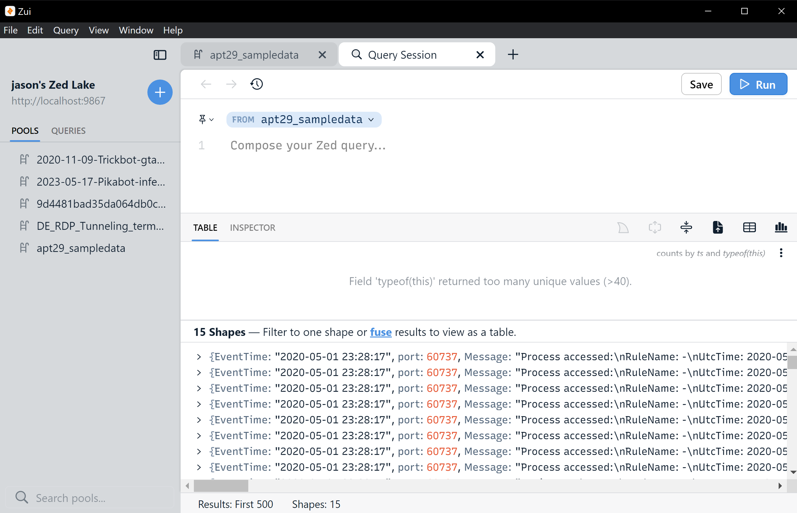

If you take a look at the first record (right-click the first record in the data, then select “Show in Detail Pane”, you’ll notice it bears a resemblance to the Windows event log data we’ve been looking at throughout the book - specifically in terms of the available attributes.

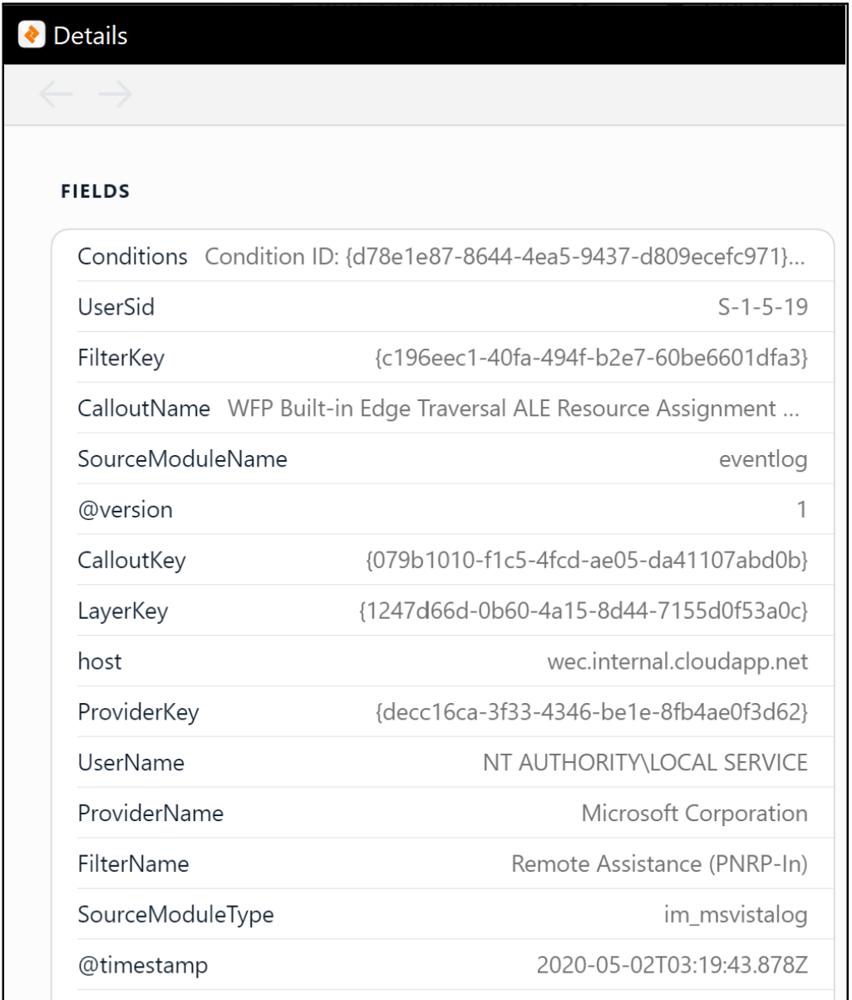

There is a handy configurable bar chart that you can configure. First click the three dots in the spot shown below. 

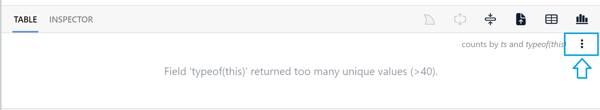

Leave the "Time Field" value as default, but enter the value "Hostname" for "Color Field", then hit Save.

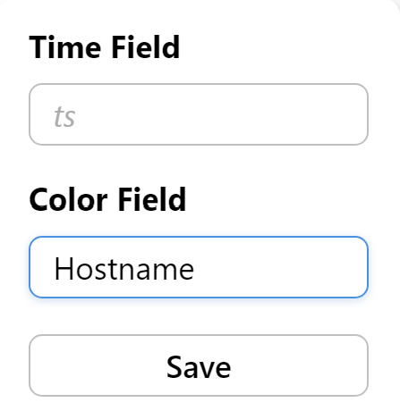

Now you'll see a neato stacked histogram that shows you the number of events per change in Hostname over time. 

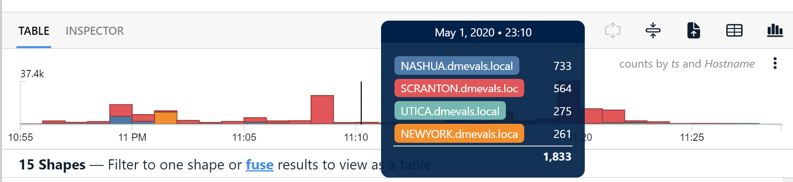

### General approach for data analysis

Broadly speaking, we can approach any data analysis task in three steps.

#### 1. Understand the data and the objectives
A less technical step. Before diving all the way in, talk to the owners of the data or domain experts, read available documentation and try to get as close as possible to understanding the chunk of data you're attepting to analyze. In our case, we know that we are looking at Windows event log data, captured during a controlled replay of an APT29 intrusion.  
We also need to clarify the objectives of the analysis. This just means working out which specific questions we want to answer. For example:
 - what happened?
 - which assets were impacted?
 - what TTPs were used?
 - which static indicators have investigative value?
 - how can we build detections to identify these events if they occur in the future? 

Having these objectives defined at the beginning of the analysis helps you appreciate the limitations of the data after the analysis is complete. Knowing what gaps exist in the data you are looking will help when designing compensating controls or building solutions to close those gaps.

#### 2. Explore the data

In this step we want to answer questions about the data itself.
 - What is the type of data? (json, csv, plain text, binary)
 - What is the shape of the data? (number of rows/ observations)
 - What attributes are available?
   - what are the possible values for those attributes? If an attribute only has one distinct value throughout the dataset, then it can usually be ignored, since it adds no informational value to each observation.
   - which events are significant? An infrequently occuring attribute value or combination of values can sometimes indicate something interesting happened. 
 - What timeframe does the dataset cover? 
 
We should ideally get the answers to these prior to answering more difficult questions such as "what happened?". 

To get started, let's get the shape of the data and understand the timeframe it covers, all in a single command. 

In the query section of the zui interface, enter the following command:

~~~
min(ts), max(ts), count()
~~~

You should see a simple table showing us the first event in the dataset, the last event in the dataset, and the total number of events (or observations).

| min | max | count |
| :--- | :--- | :--- | 
| 2020-05-01T22:55:23Z | 2020-05-01T23:28:17Z | 196081 |

Here we simply used three aggregate functions to perform the following:

 - min(ts) : find the smallest value in the 'ts' field. This will return the earliest occuring event.
 - max(ts) : find the largest value in the 'ts' field. This will return the last event in the dataset.
 - count() : count the number of observations in the dataset.

No we know the Mordor dataset contains 196,081 events, covering a period of just over 32 minutes.

Let's go a step further and see what kind of events are in the dataset. In Zui, enter the following query:

~~~
min(ts), max(ts), count() by Channel | sort min
~~~

| Channel | min | max | count | 
| :--- | :--- | :--- | ---: |
| Microsoft-Windows-Sysmon/Operational | 2020-05-01T22:55:23Z | 2020-05-01T23:28:17Z | 143884 | 
| Security | 2020-05-01T22:55:25Z | 2020-05-01T23:28:09Z | 28627 | 
| Microsoft-Windows-PowerShell/Operational | 2020-05-01T22:56:14Z | 2020-05-01T23:21:30Z | 5694 | 
| Windows PowerShell | 2020-05-01T22:56:15Z | 2020-05-01T23:21:30Z | 5285 | 
| Microsoft-Windows-WMI-Activity/Operational | 2020-05-01T22:56:47Z | 2020-05-01T23:22:41Z | 90 | 
| System | 2020-05-01T23:01:34Z | 2020-05-01T23:23:08Z | 91 | 
| Microsoft-Windows-TerminalServices-LocalSessionManager/Operational | 2020-05-01T23:18:33Z | 2020-05-01T23:20:48Z | 9 | 
| security | 2020-05-01T23:18:35Z | 2020-05-01T23:28:09Z | 12375 | 
| Microsoft-Windows-TerminalServices-RemoteConnectionManager/Operational | 2020-05-01T23:19:11Z | 2020-05-01T23:20:42Z | 15 | 
| Microsoft-Windows-Windows Firewall With Advanced Security/Firewall | 2020-05-01T23:19:16Z | 2020-05-01T23:21:05Z | 10 | 
| Microsoft-Windows-Bits-Client/Operational | 2020-05-01T23:19:50Z | 2020-05-01T23:19:50Z | 1 | 

At a glance, we can see the most events were recorded in the Sysmon logs. Interestingly, there is only a single event for the channel 'Microsoft-Windows-Bits-Client/Operational'. This makes the event significant within this dataset, but it's not guranteed to hold investigative value.

We can take a close look at the types of sysmon events within the dataset. Execute the following query against the dataset:

~~~
msg:=split(Message,":")[0]
| SourceName=="Microsoft-Windows-Sysmon"
| count(), min(ts), max(ts) by msg 
| sort min
~~~

In this query, we create use the split function to create a new convenience column named 'msg' for our analysis. We then filter the dataset to only return events where the source is "Microsoft-Windows-Sysmon", and use aggregation functions to get the number of events, earliest event and last event for each value of 'msg'.

| msg | count | min | max
| :--- | :--- | :--- | :--- |
Process accessed | 39283 | 2020-05-01T22:55:23Z | 2020-05-01T23:28:17Z
Network connection detected |1229|2020-05-01T22:55:26Z|2020-05-01T23:27:55Z
File created | 1649 | 2020-05-01T22:55:28Z | 2020-05-01T23:28:11Z
Process terminated | 401 | 2020-05-01T22:55:28Z|2020-05-01T23:28:09Z
Registry value set | 17541| 2020-05-01T22:55:29Z | 2020-05-01T23:28:17Z
Registry object added or deleted | 61151 | 2020-05-01T22:55:30Z | 2020-05-01T23:28:00Z
Image loaded | 20259 | 2020-05-01T22:55:32Z | 2020-05-01T23:28:12Z
Pipe Connected | 362 | 2020-05-01T22:55:46Z | 2020-05-01T23:26:49Z
Process Create | 447 | 2020-05-01T22:55:56Z | 2020-05-01T23:26:11Z
Dns query | 81 | 2020-05-01T22:56:01Z | 2020-05-01T23:26:15Z
Pipe Created | 84 | 2020-05-01T22:56:04Z | 2020-05-01T23:21:29Z
File Delete | 422 | 2020-05-01T22:56:15Z | 2020-05-01T23:27:11Z
RawAccessRead detected | 652 | 2020-05-01T22:56:47Z | 2020-05-01T23:26:48Z
File creation time changed | 209 | 2020-05-01T22:58:44Z | 2020-05-01T23:27:11Z
CreateRemoteThread detected | 95 | 2020-05-01T23:05:16Z | 2020-05-01T23:20:44Z
File stream created | 18 | 2020-05-01T23:18:35Z | 2020-05-01T23:19:44Z
Sysmon service state changed | 1 | 2020-05-01T23:19:18Z | 2020-05-01T23:19:18Z

While this data doesn't get us closer to understanding exactly what happened, it does give us a better high-level understanding of the events contained in the dataset. 

Finally, let's just look at some actual data to see what it looks like. We know it's json, but we'll take a quick peek to get familiar with the attributes in some of the documents. Execute the following command:

~~~
head 10
~~~

now click on "INSPECTOR" above the histogram. If you expand the first result (by clicking '>' next to the first result). You will see a screen similar to the following:

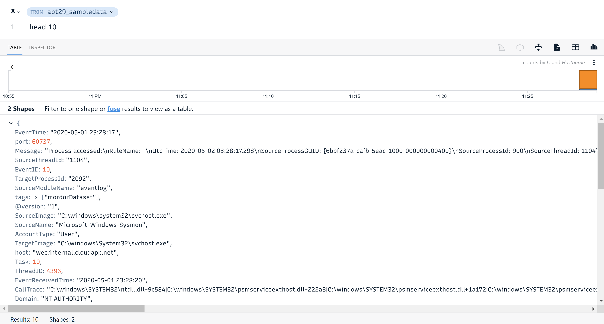

This view makes it easy to view a small number of documents, and gives us a high-level understanding of the data within.

#### 3. Find threads to pull

Now at this point you *could* potentially jump into a threat hunting process,(i.e establish a hypothesis, and begin analysis around that hypothesis) but when you're working with a sample dataset, chances are you already have an idea of what you are looking for. For the specific problem of finding potential evil in security data you want your data tools to enable the following:
 - Search the data for keywords, and pivot on significant keywords. Think of using a tool like SQL - you can interact with the data and have a high degree of control when running queries, but you can't do a blanket search of all columns for a string value...or at least not easily. This is why tools like splunk and elasticsearch are popular with security analysts. They want to search for a keyword regardless of which attribute contains the keyword.
 - Understand the prevelance of specific attributes. For example if we see a specific application error recorded in logs around the same time a malicious event occurs - it could have been a result of the malicious event... or completely normal. Simple summary statistics can help clarify these events.
 - View a sequence of events between a given timeframe. The requirements here are simply that your data platform of choice can understand datetime values, and can let you view events sequentially, between specified times.

To start let's just look at events sequentially. We see that Sysmon events are being captured, so we can just take a quick read through of what was run in the environment.

We can get this data by executin the following query:

~~~
EventID==1
| select ts,Hostname,ParentCommandLine, CommandLine, User
| sort ts 
| fuse
~~~

Scroll through the data and see if you notice anything suspicious (it won't take long). The second event in the resultset looks like this:

~~~json
{
 ts: 2020-05-01T22:56:04Z, 
 Hostname: "SCRANTON.dmevals.local", 
 ParentCommandLine: ""C:\ProgramData\victim\‮cod.3aka3.scr" /S", 
 CommandLine: ""C:\windows\system32\cmd.exe"", 
 User: "DMEVALS\pbeesly"
}
~~~

Here we have a .scr file initiating the Windows command prompt (cmd.exe), which is unusual. See if you can find more information about this scr file on the internet. As you review events in the dataset, you should attempt to classify them by MITRE ATT&CK technique. This classification will help when developing detections.

## Logstash

When handling data at any level, you will inevitably run into the problem of needing the data to be modified from one format to another, or moved from one tool to another. In our current scenario, we need to get this Mordor dataset, in the form of line-delimited JSON data, into our main data store, elasticsearch. Logstash is Elastic’s tool for addressing problems like this. In this section, we will develop a simple logstash configuration file, which will contain the details about where the source data is, its current format, the destination, and how to transform the data before it gets sent to its destination. 

First, we need to download logstash. On Windows systems, you can download a copy from here: https://www.elastic.co/downloads/logstash. You’ll get a simple zip file that you can extract to any convenient directory. Once downloaded and extracted, you can run logstash by invoking “logstash.bat” from the “bin” subdirectory. Since we are running logstash for the first time, with no configuration details, we will get an error similar to the following:

ERROR: Pipelines YAML file is empty. Location: c:/path_to_logstash/logstash/logstash-8.7.0/config/pipelines.yml

We can ignore this message for now, since we’ll be creating a configuration file for logstash to operate on, later in this section.

For macOS systems, the process is similar. The download option in this case is a tar.gz archive, which can be extracted using the tar command. For example:

Tar -xvf logstash-8.X.X-darwin-<<arch>>.tar.gz

On Linux systems, we have the option of downloading the linux tar.gz file, or using a package manager. The instructions for using apt and yum are found here: https://www.elastic.co/guide/en/logstash/8.7/installing-logstash.html. Otherwise, if you prefer not to use a package manager, you can download the appropriate linux tar.gz archive from the main download page.

### Elastic Data Streams

The elastic data stream is a method for organizing data in elasticsearch, which is optimized for “append-only time series” data. This description sounds precisely like the type of data we work with as detection engineers. Unlike transactional data, which gets created, read, updated and deleted constantly, system and security telemetry gets used differently. When an event occurs, it gets recorded with the attributes available at that point in time.  It gets stored or written once, and is only ever read after being stored.

### The Logstash pipeline configuration file

Now that we know where our source data is, and we know that we’d like to store it in an elastic data stream, we can start building our logstash configuration file. These files normally comprise three sections:
 - Inputs - Tells logstash where the data is and what format it is in
 - Filters - One of the primary reasons to use logstash. This section can contain instructions for performing multiple intermediary operations on the data as it is being processed. This is particularly powerful when changing dataset formats, attaching features or converting attribute data. 

As seen earlier, the Mordor sample data is stored in JSON format. We can tell logstash all about it with the following pipeline configuration file “input” section:

~~~json
input {
    file {
        path => "C:/path/to/samples/mordor_apt29_day1/*"
        start_position => beginning
        codec => "json"
    }
}
~~~

We plan to store the data in a data in a data stream in our elastic instance, so our “output” section can look something like this:

~~~json
output {
    elasticsearch {
        hosts => ["<<IP address to your elastic stack>>:9200"]
        user => "<<your username>>"
        password => "<<your password>>"
        ssl => true
        ssl_certificate_verification => false
        data_stream => true
        data_stream_type => "logs"
        data_stream_dataset => "mordor"
        data_stream_namespace => "apt29"
    }
}

~~~

Note, as before, the SSL certification verification setting is insecure, and should not be used in this way for production deployments. Optionally, instead of the username/ password, you can use the “api_key” option, if you created one in your elastic instance.

To avoid a conflict with our existing mapping settings, we’ll also need to add a filter to change the mapping of one of our fields.

~~~json
filter { 
    mutate {
        rename => {
            "host" => "host.name"
        }
    }
}

~~~

Our final configuration file should look something like this:

~~~json
input {
    file {
        path => "C:/path/to/samples/mordor_apt29_day1/*"
        start_position => beginning
        codec => "json"
    }
}
filter { 
    mutate {
        rename => {
            "host" => "host.name"
        }
    }
}
output {
    elasticsearch {
        hosts => ["<<IP address to your elastic stack>>:9200"]
        user => "<<your username>>"
        password => "<<your password>>"
        ssl => true
        ssl_certificate_verification => false
        data_stream => true
        data_stream_type => "logs"
        data_stream_dataset => "mordor"
        data_stream_namespace => "apt29"
    }
}

~~~

Save this file as “import_mordor_apt29.conf”. Finally, we can run logstash to move our sample data into Elasticsearch.

Windows:
Starting from a command prompt in the directory you extracted logstash into, issue the following command:

~~~bash
bin/logstash.bat -f c:\path\to\import_mordor_apt29.conf
~~~

Linux/ macOS:
~~~bash
bin/logstash -f /path/to/import_mordor_apt29.conf
~~~

Logstash will work in the background to move the data into an Elasticsearch data stream. You can check on the import by navigating to Management -> Stack Management -> Index Management -> Data Streams.
From that screen, search for “mordor”, and you’ll see your new data stream in the listing.

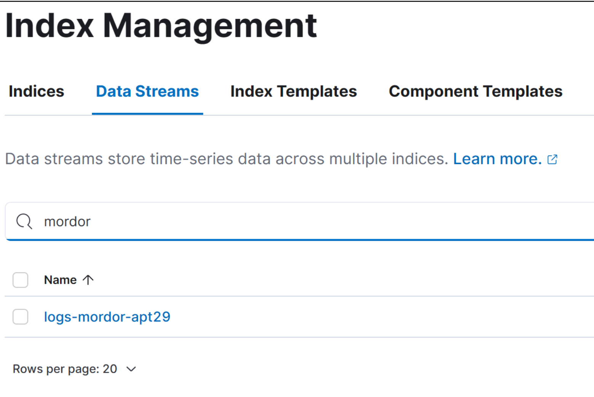

To explore the data, navigate to Analytics -> Discover.

Keep in mind, as we saw earlier, the data was recorded back in 2020, so we need to adjust our time filters on the discover page. Use the datetime range May 1 2020 to May 2 2020.

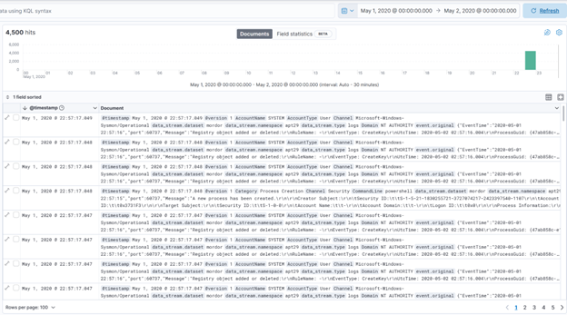

And there your data is! Ready for analysis.

## EVTX-ATTACK-SAMPLES

Another rich source of sample data is Samir Boussean’s EVTX-ATTACK-SAMPLES repository on GitHub. This repo contains sample Windows event log files for multiple attack replays, organized by MITRE tactic. 

Since we can’t directly move Windows event log files into Elasticsearch, we have to take a multi-step approach to ingesting these for exploration. We know that we can move json data into Elastic using Logstash, and luckily, there is an excellent solution for turning Event log files into json over on omerbenamram’s GitHub repository. This Rust-based EVTX parser is located here: https://github.com/omerbenamram/evtx.

To get started, download the appropriate evtx_dump release for your operating system, and converting our evtx file to line-delimited json is as simple as issuing the following command:

~~~
evtx_dump.exe DE_Powershell_CLM_Disabled_Sysmon_12.evtx -o jsonl >events_converted.ndjson
~~~

This will output a json file, which we can then move into Elastic. Here is a simple Logstash pipeline configuration to get this data ingested.

~~~json
input {
        file {
                path => "C:/progs/data/samples/evtx_dump/*"
                start_position => beginning
                codec => "json"
        }
}
output {
        elasticsearch {
        hosts => ["10.30.23.160:9200"]
        user => "elastic"
        password => "<<your password>>"
        ssl => true
        ssl_certificate_verification => false
        data_stream => true
        data_stream_type => "logs"
        data_stream_dataset => "event-log-sample"
        data_stream_namespace => "sampledata"
        }
}
~~~

## Sample Packet Capture (PCAP) data

Sample network data also exists in abundance. One excellent resource is malware-traffic-analysis.net (https://malware-traffic-analysis.net/)

The technical blog posts are focused on documenting the network traffic related to different malware samples. These posts come with a technical writeup, full packet captures and samples of the malware in focus.

Getting acquainted with what malicious network traffic can look like is as simple as downloading the pcap files attached to the technical write up.
The quintessential tool for looking at packet capture data is Wireshark (available here: https://www.wireshark.org/). 

For this next section, we will review the pcap file located here: https://malware-traffic-analysis.net/2023/05/17/index.html. 

#### IMPORTANT
This packet capture recorded the download of malware, specifically a Pikabot sample. If using a Windows workstation, you will likely need to work with this file from a directory that was excluded from Windows defender scanning. This is obviously dangerous so please be careful when interacting with this file. Specifically, avoid exporting any objects. If you are viewing this packet capture on macOS or Linux, the risk is significantly lower.

After installing Wireshark and using it to open a pcap file, you will be presented with a screen similar to the following

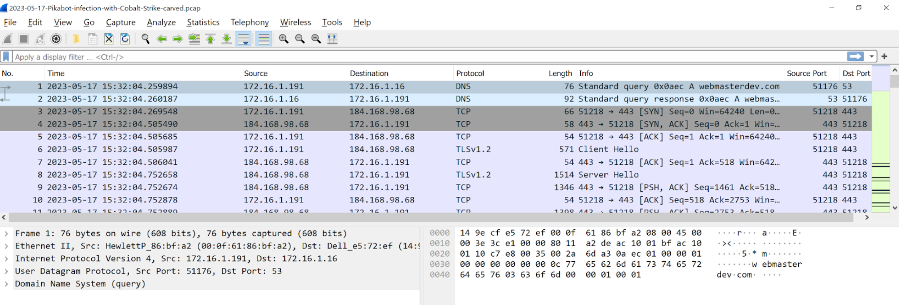

Each row in the main window represents a network packet that was transmitted or received by the packet capturing node. One of the fastest ways to get acquainted with a dataset is from the statistics menu. Clicking on Statistics -> IPv4 statistics -> All Addresses gives you an understanding of the IPv4 hosts in the packet capture, and how frequently they appear in the dataset. This is useful for quickly spotting anomalies. Filtering the data for a specific protocol is as simple as entering the protocol into the display filter and hitting enter.

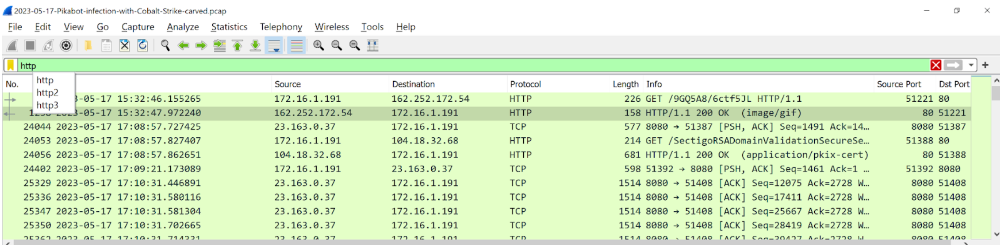

If there is a specific packet that looks interesting, you can view the full conversation by right-clicking the packet, select “Follow", then “HTTP stream” (for HTTP traffic).

For the first packet shown when the “http” filter is applied, you will notice something strange about this conversation. Specifically while the ‘Content-Type’ is “image/gif”, the bytes start with “MZ”, then eventually we see the text “This program cannot be run in DOS mode.”. These features indicate that the file returned was an executable, masquerading as an innocent-looking gif file.

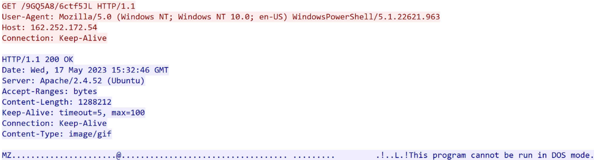

